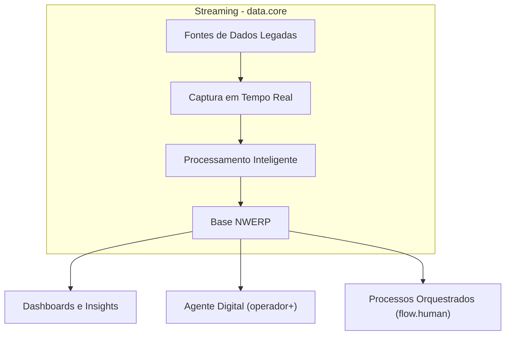
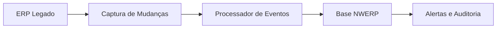
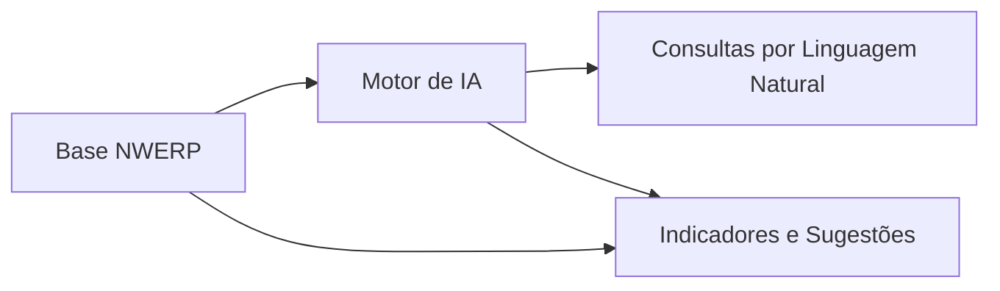
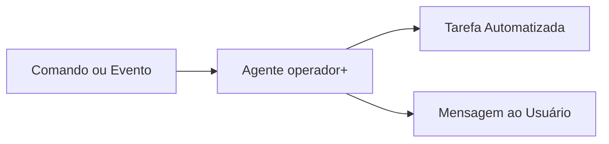
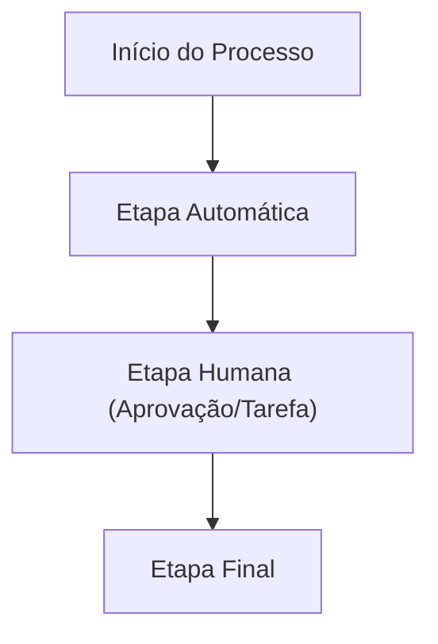

  ![[ProdutoModulos.png]]

## Visão Geral

A NWERP transforma ERPs legados em plataformas modernas, inteligentes e rastreáveis, atuando como uma camada complementar que não substitui o ERP, mas o amplia com inteligência, automação e dados em tempo real.

  

## Missão

Modernizar a operação sem comprometer o legado, mantendo o ERP atual para obrigações fiscais e para-legais, enquanto a NWERP assume o papel de plataforma de inovação.

  

---

  

## Problemas Atuais no Mercado

- Fragmentação e lentidão dos ERPs legados

- Falta de visibilidade em tempo real

- Dependência de tarefas manuais

- Dificuldade de integração com novas tecnologias

  

---

  

## A Solução NWERP

- Cloud-native, API-first e modular

- Extração e centralização de dados em tempo real

- IA com LLM para análise e execução de processos

- Orquestração inteligente com rastreabilidade total

  

---

  

## Arquitetura Conceitual
  

  

---

  

## Integração com o ERP Legado

- O ERP atual permanece como fonte de obrigações fiscais
- A NWERP atua como camada moderna e paralela
- Nenhuma funcionalidade fiscal é substituída
- Inovação sem impacto na conformidade

---

  

## Estrutura da NWERP 
  

### 1. `data.core`

Central de sincronização e monitoramento de dados.

  

### 2. `insight.ai`

Dashboards em tempo real e análise assistida por IA.

  

### 3. `operador+`

Agente digital que executa tarefas e se comunica com os usuários.

  

### 4. `flow.human`

Orquestração de processos com etapas humanas e automáticas.

  

---

  

## Diferenciais Estratégicos

- Rastreabilidade ponta-a-ponta
- Inteligência contextual com IA
- Interação humana e automação no mesmo fluxo
- Tempo de implantação reduzido
- Expansão sem travar o legado

  

---

  
## Casos de Uso

- Processos de compras, vendas, recebimento e atendimento
- Dashboards com perguntas em linguagem natural
- Automações com decisões guiadas por IA
- Aprovações e validações manuais integradas ao fluxo

  

---

  
## Modelo de Negócio

- Licenciamento modular ou por suíte
- SaaS ou infraestrutura híbrida
- Receita recorrente com alto valor agregado
- Expansão via parcerias e integrações estratégicas

  

---

  

## Roadmap

- Expansão dos conectores e automações
- Ferramentas low-code para configuração de fluxos
- Análises preditivas baseadas em comportamento
- Plataforma aberta à integração com ecossistemas

  

---

  

## Contato

- Site: www.nwerp.com.br
- E-mail: contato@nwerp.com.br
- Redes sociais: @nwerp.digital

# Informações Técnicas

[[NWERP - DOCUMENTAÇÃO TÉCNICA]]

#nwerp
