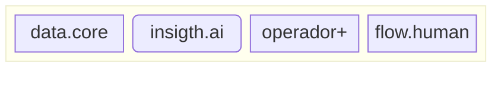
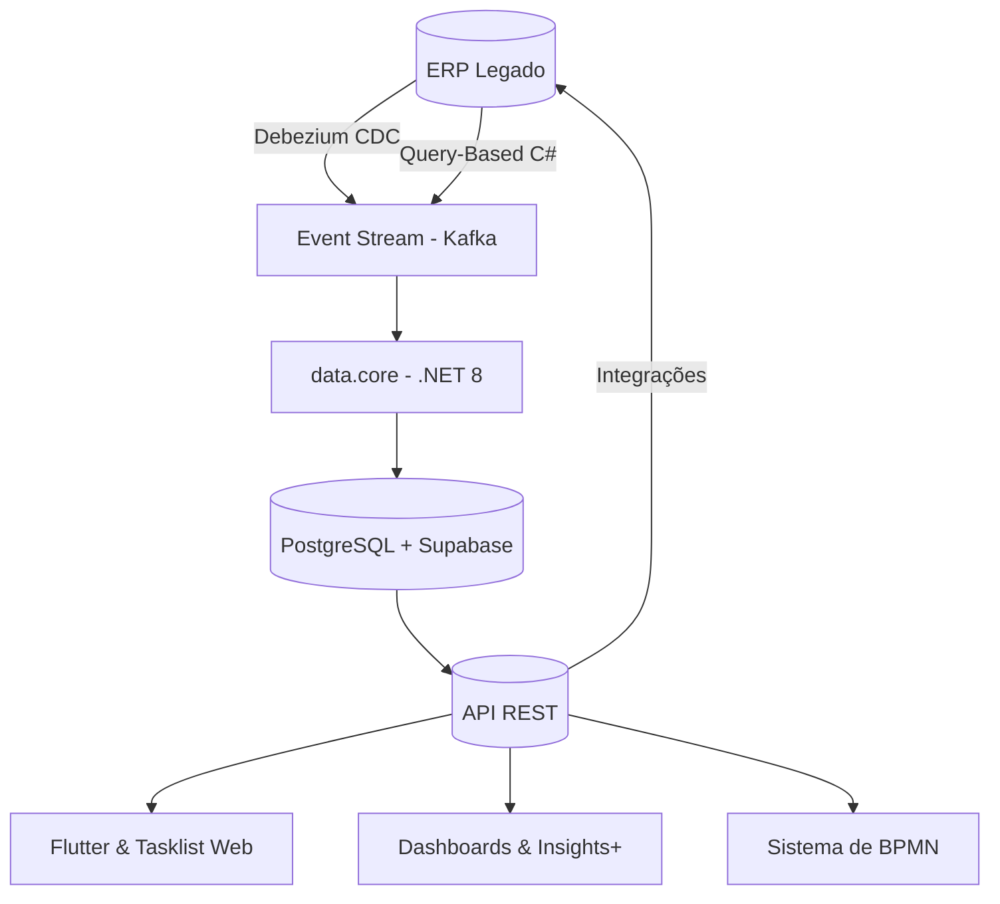
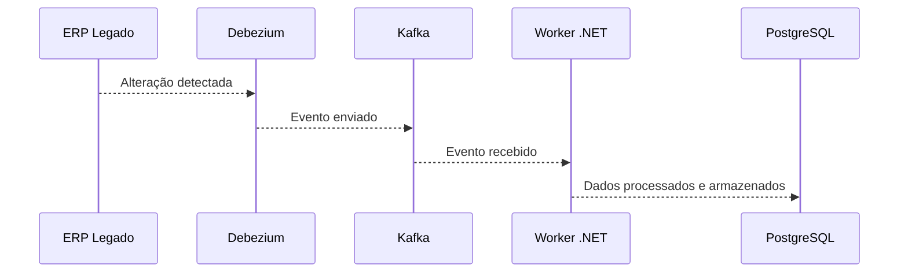
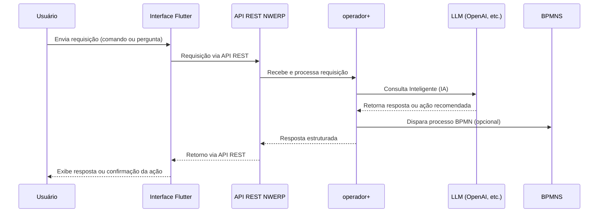
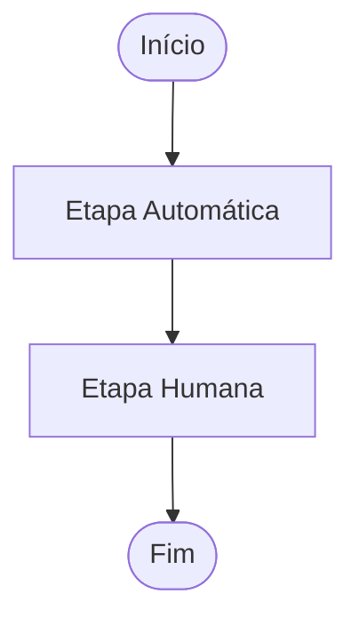

Este documento apresenta uma visão geral técnica da NWERP, plataforma complementar ao ERP legado, projetada para integrar dados em tempo real, oferecer automação inteligente, processos auditáveis com BPMN e interfaces modernas em Flutter e React.

---

## 🛠️ Tecnologias

### Backend
- **C# .NET 8** (núcleo dos serviços)
- **Entity Framework e Dapper** (persistência)
- **Hangfire** (jobs agendados e recorrentes)
- **Kafka** (mensageria assíncrona)
- **Debezium** (captura de mudanças - CDC)

### Orquestração de Processos
- **Camunda BPMN**

### Frontend
- **Flutter** (mobile)
- **Fork Camunda Tasklist** (web)

### Observabilidade e Segurança
- **OpenTelemetry** (logs estruturados e rastreáveis)
- **JWT com Supabase Auth** (autenticação)

### Bases de Dados
- **PostgreSQL**
- **Supabase** (dados e autenticação)

---

## 📐 Arquitetura Geral

---

## 🔄 data.core

* Streaming de dados do ERP
* Importação/Integração de dados externos para o ERP
* Exportação de Logs

---

## 🧠 insight.ai
- Análise e consulta inteligente
- Geração automática de gráficos e dashboards
- Interações via Flutter/React (UI)

---

## 🤖 operador+
- Agente digital com LLM
- Executa comandos via eventos ou linguagem natural
- Comunicação via APIs REST
- Interface chatbot e Flutter 

---

## 👤 flow.human 

- Processos BPMN com Camunda
- Tarefas automáticas e humanas
- Interface via Flutter e Tasklist Web
- Execução rastreável e auditável

---

- **Flutter** (iOS, Android)
- **Fork do Camunda Tasklist** (interfaces web customizadas)

**Benefícios:**
- Interface consistente e otimizada
- Desenvolvimento acelerado com fork
- Alta flexibilidade

**Cuidados:**
- Manutenção contínua do fork
- Sincronização periódica com atualizações Camunda

---

## 🚀 CI/CD e Deploy
- Containers Docker
- GitHub Actions e GitLab CI
- Versionamento Semântico
- Ambientes: desenvolvimento, staging, produção

---

## 📅 Roadmap
- Novos conectores (SAP, Protheus)
- Regras via DMN
- Decisões automatizadas (`operador+`)
- SDK para Flutter (tarefas customizadas)

---

## 📩 Contato Técnico
- **Email:** dev@nwerp.com.br
- **Git:** Privado (SSH)

---

## 🚧 Considerações Finais

A arquitetura NWERP promove flexibilidade e robustez, permitindo a modernização gradual e integrada de ERPs legados, oferecendo uma solução escalável e eficiente.
